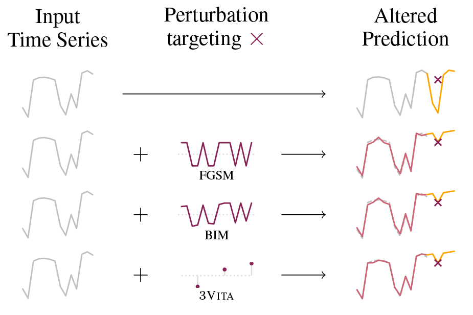

# nVITA -- The adversarial example generation algorithm for time series forecasting (TSF)

This repository is for the *nVITA* algorithm.

It also contains *FGSM* and *BIM* and two baseline attacks *BRS* and *BRNV* for TSF.

In addition, Targeted FGSM (FGSMt) and Targeted BIM (BIMt) are also included.



*BRS* randomly selects the *sign* of the perturbation. It is the **baseline** attack method for *FGSM*, *BIM* and *FullVITA*

*BRNV* randomly selects *n* values to attack. It is the **baseline** attack method for *nVITA*

## Raw Data

*/raw_data* is too large to be uploaded on Github.

Raw data *opsd_germany_daily.csv* for **Electricity** can be downloaded [here](https://www.kaggle.com/datasets/mvianna10/germany-electricity-power-for-20062017)

Raw data *GlobalLandTemperaturesByCity.csv* for **NZTemp** [here](https://www.kaggle.com/datasets/berkeleyearth/climate-change-earth-surface-temperature-data)

**CNYExch** and **Oil** are downloaded directly from [Yahoo Finance](https://finance.yahoo.com/) by using python library **Yfinance** in *step1_preprocessing.ipynb*

## Saved Dataset, Models

step1 to step3 have already been run, and result files (split data, trained model) are saved in the result directory.

Notice the experiments cannot be carried out without those result files.

### Step 1 data preprocessing

*step1_preprocessing.ipynb* **CANNOT** be run without *opsd_germany_daily.csv* and *GlobalLandTemperaturesByCity.csv* are placed in */data/raw_data* directory.

It preprocesses the data and draws the Autocorrelation Function (ACF) plot with the clean data by using python libary **Statsmodels**.

### Step 2 hyperparameter tuning

*step2_hyperparameter_tuning.ipynb* splits the data and stores them in */results/splitted_data*. It also tunes the hyperparameters of the models and stores them in */experiments/metadata.json*

### Step 3 model training

*step3_train_model.ipynb* trains the model with the hyperparameters tunned from step2 and saves the models in */results/saved_model*

## Running of the code

In order to reproduce the experiment results, *step4_attack_non_target.py*  and *step5_attack_target.py* are required to be rerun.

### Requirements

Under the nvita directory to install nvita package, use

```console
 pip install .
```

The experiment code is mainly based on the following libaries: **Pytorch**, **BLiTZ**, **Sklearn**, **SciPy**, **Numpy**, **Yfinance**, **Statsmodels**

The visulization code is mainly based on the following libaries: **Pandas**, **Matplotlib**, **Seaborn**, **Autorank**

*requirements.txt* is the package requirments for Windows

*requirements_recovered.txt* is the package requirements for Linux

### Note before running

As mentioned above step1 to step3 have already been run, and the split data and trained models are saved. So running Step 4 and Step 5 would be enough for reproducing the experiments.

**NOTE** that *FGSM* and *BIM* **CANNOT** attack *RF(random forest)* while *nVITA* and *fullVITA* can.

For *NVITA*, *n* = ["1", "3", "5"], but for *BRNV*, *n* = 5 alone would be enough.

*n* = 10 is not included in metadata.json, so it cannot be run currently. We will run it if we have spare time.

**NOTE** that only the first four datasets have gone through step1 to step3. There will be more datasets after all our experiments have been completed on those four datasets.

### Running of the experiments

All files in */results/splitted_data* and */results/saved_model* are reuqired to run for step4 and step5

#### Step 4 non-targeted experiments

*step4_attack_non_target.py* takes the following arguments:

**"-d", "--dfname"**, type=str, the name of dataframe, must be one of the name from **["Electricity", "NZTemp", "CNYExch", "Oil"]**

**"-s", "--seed"**, type=int, the seed integer, must be one of the seed from **["2210", "9999", "58361", "789789", "1111111"]**

**"-m", "--model"**, type=str, the attacked model name, must be one of the name from **["CNN", "LSTM", "GRU", "RF"]**

**"-a", "--attack"**, type=str, the attack name,  must be one of the attack name from **["NOATTACK", "BRS", "BRNV", "FGSM", "BIM", "NVITA", "FULLVITA"]**

**"-e", "--epsilon"**, type=float, the epsilon for the attack, must be one from **["0.05", "0.1", "0.15", "0.20"]**

**"-n", "--n"**, type=int, the *n* value for BRNV and NVITA. This will be ignored if the attack name is other than "BRNV" and "NVITA". The n value must be one of the **["1", "3", "5"]**

Optional **"--demo"**, the demo size integer, must range from 1 to 100. If we don't pass this parameter, we will run the complete experiments. If we pass an integer as demo size, the result output directory will be */examples*

Example command for non-targeted demo experiment run:

```console
python experiments\step4_attack_non_target.py -d Electricity -s 2210 -m CNN -a NVITA -e 0.2 -n 1 --demo 10
```

Will run the first 10 test window for experiment (dataset Electricity, seed 2210, model CNN, attack NVITA, epsilon=0.2, n=1)

And results will be saved in */examples/non_targeted_results*.

Example command for non-targeted complete experiment run:

```console
python experiments\step4_attack_non_target.py -d Electricity -s 2210 -m CNN -a NVITA -e 0.2 -n 1
```

Will run the all 100 test windows for experiment (dataset Electricity, seed 2210, model CNN, attack NVITA, epsilon=0.2, n=1)

And results will be saved in */results/non_targeted_results*.

#### Step 5 targeted experiments

Apart from **ALL** of the arguments *step4_attack_non_target.py* requires,

*step5_attack_target.py* takes another argument:

**"-t", "--target"**, type=str, the target direction, it must be either **"Positive"**, or **"Negative"**

Example command for targeted demo experiment run:

```console
python experiments\step5_attack_target.py -d Electricity -s 2210 -m CNN -a NVITA -e 0.2 -n 1 -t Positive --demo 10
```

Will run the first 10 test window for (dataset Electricity, seed 2210, model CNN, attack NVITA, epsilon=0.2, n=1, Positive target)

And results will be saved in */examples/targeted_results*.

Example command for targeted complete experiment run:

```console
python experiments\step5_attack_target.py -d Electricity -s 2210 -m CNN -a NVITA -e 0.2 -n 1 -t Positive
```

Will run the all 100 test window for experiment (dataset Electricity, seed 2210, model CNN, attack NVITA, epsilon=0.2, n=1, Positive target)

And results will be saved in */results/targeted_results*.

## Result Interpretation

For non-targeted attacks, the **absolute error (AE)** is measured between the model prediction and ground truth y. Thus, a larger AE indicates better attack performance.

For targeted attacks, the **absolute error (AE)** is measured between the model prediction and attack goal target value. Thus, a smaller AE indicates better attack performance as we make the model prediction closer to our target after the attack.

### Result Visulization

After experiments (step 4 and step 5) are completed.

Jupyter notebook *result_visulization_main.ipynb* and *result_visulization_supp.ipynb* can produce the plots for the paper and the supplementary material, respectively.

Notice that those two notebooks would not run appropriately without the result file recorded by step 4 and step 5.

*/visualization/main_plots* directory stores all the plots in the paper

*/visualization/supp_plots* directory stores all the plots in the paper
